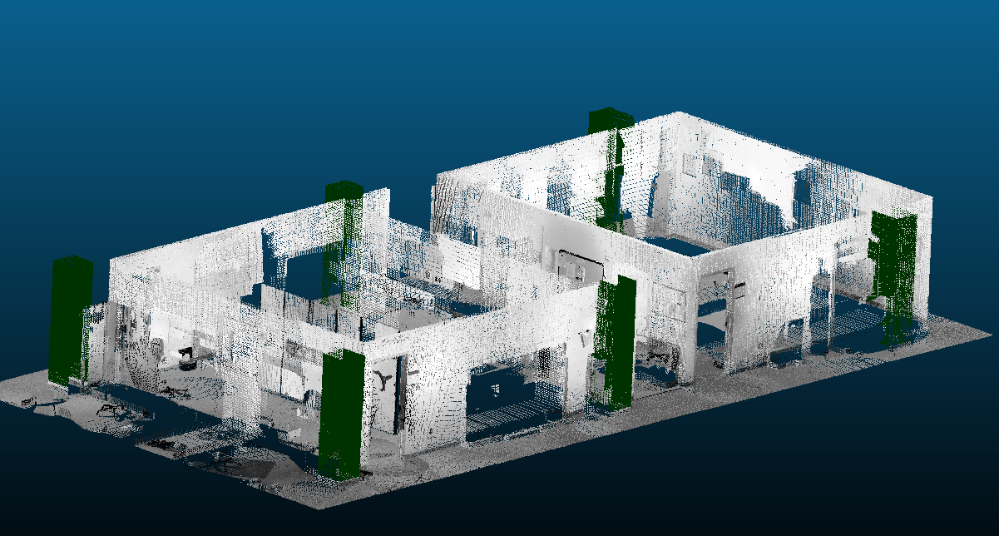
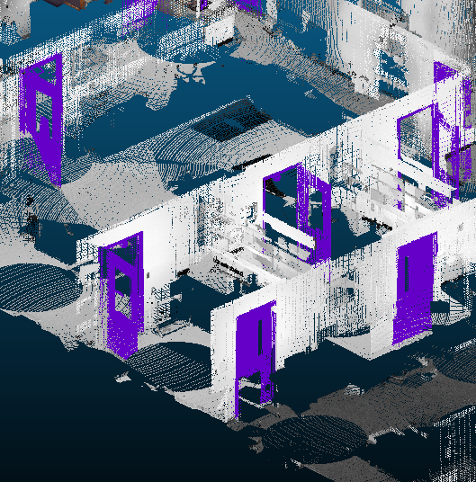

<a name="readme-top"></a>


[![Issues][issues-shield]][issues-url]
[![MIT License][license-shield]][license-url]
[![LinkedIn][linkedin-shield]][linkedin-url]


<!-- PROJECT LOGO -->
<br />
<div align="center">
  <a href="https://github.com/ajavanma/RPTU_AI_Toolkit/blob/main">
    
  </a>

  <h3 align="center">RPTU-AI-Toolkit</h3>

  <p align="center">
    A toolkit for preprocessing, training and inference
    <br />
    <a href="https://arash.gitbook.io/rptu-ai-toolkit/"><strong>Explore the docs »</strong></a>
    <br />
    <br />
    <a href="https://github.com/ajavanma/RPTU_AI_Toolkit/blob/main">View Demo</a>
    ·
    <a href="https://github.com/ajavanma/RPTU_AI_Toolkit/issues/new">Report Bug or Request Feature</a>
  </p>
</div>


<!-- TABLE OF CONTENTS -->
<details>
  <summary>Table of Contents</summary>
  <ol>
    <li>
      <a href="#about-the-project">About The Project</a>
      <ul>
        <li><a href="#built-with">Built With</a></li>
      </ul>
    </li>
    <li>
      <a href="#getting-started">Getting Started</a>
      <ul>
        <li><a href="#prerequisites">Prerequisites</a></li>
        <li><a href="#installation">Installation</a></li>
      </ul>
    </li>
    <li><a href="#usage">Usage</a></li>
    <li><a href="#roadmap">Roadmap</a></li>
    <li><a href="#contributing">Contributing</a></li>
    <li><a href="#license">License</a></li>
    <li><a href="#contact">Contact</a></li>
    <li><a href="#acknowledgments">Acknowledgments</a></li>
  </ol>
</details>


## About The Project

  <a href="https://github.com/ajavanma/RPTU_AI_Toolkit/blob/main">
    
  </a>
    <a href="https://github.com/ajavanma/RPTU_AI_Toolkit/blob/main">
    
  </a>


### Built With


* [![PyTorch][PyTorch]][PyTorch-url]
* [![MinkowskiEngine][MinkowskiEngine]][MinkowskiEngine-url]


  <a href="https://github.com/ajavanma/RPTU_AI_Toolkit/blob/main">
    
  </a>


## Getting Started

1. Create and activate a conda environment:
   ```sh
   conda create --name mink python=3.8
   conda activate mink

2. Install Poetry:
   ```sh
   curl -sSL https://install.python-poetry.org | python3 -

3. Install project dependencies:
poetry install

4. Set config parameters in config/config.yaml file

5. poetry run python src/main.py


6. set config parameters in config.yaml file   

7. conda activate mink  

8. python main.py  


### Dependencies

MinkowskiEngine: calculation of sparse tensors  

o3d: manipulation of points (coords), colors and normals 


# Program structure
Data Preparation
1. Raw Data Analysis: Generate report of each asc and pcd file, check for skewed distribution.
2. Preprocessing:
Data Preparation: Feature selection, data cleansing, transforming, outlier removal, scaling (normalization/standardization).
Feature Engineering: Imputation (managing missing data), one-hot encoding of categorical features.
3. Reports
Training and Evaluation
Iteration (hyperparameter tuning)
Test and Verification
Visualizing


# File hierarchy
data/     &nbsp;   &nbsp;   &nbsp;   &nbsp;   &nbsp;  &nbsp;   &nbsp;  &nbsp;   &nbsp;   # Raw and processed data (pcd, asc, ply), mapping dictionaries (yaml)  
logs/  &nbsp;   &nbsp;   &nbsp;   &nbsp;   &nbsp; &nbsp;   &nbsp;   &nbsp;  &nbsp;     # Logs and reports  
models/   &nbsp;   &nbsp;   &nbsp;   &nbsp;  &nbsp;   &nbsp;       # Trained models  
notebooks/  &nbsp;   &nbsp;   &nbsp;     # Jupyter notebooks for exploration and visualization (sanity check of raw and processed data)  
src/    &nbsp;   &nbsp;   &nbsp;   &nbsp;   &nbsp;    &nbsp;   &nbsp;   &nbsp;   &nbsp;    # Source code  
| ── __init__.py  
| ── config/  
│     &nbsp;   &nbsp;   &nbsp;   &nbsp;   &nbsp;  |── config.yaml  
│     &nbsp;   &nbsp;   &nbsp;   &nbsp;   &nbsp;  |── preprocessing.yaml  
│     &nbsp;   &nbsp;   &nbsp;   &nbsp;   &nbsp;  |── training.yaml  
│     &nbsp;   &nbsp;   &nbsp;   &nbsp;   &nbsp;  └── inference.yaml  
| ── data/  
│     &nbsp;   &nbsp;   &nbsp;   &nbsp;   &nbsp;  └── preprocessing.py  
| ── models/  
│     &nbsp;   &nbsp;   &nbsp;   &nbsp;   &nbsp;  └── model.py  
| ── training/  
│     &nbsp;   &nbsp;   &nbsp;   &nbsp;   &nbsp;  |── train.py  
│     &nbsp;   &nbsp;   &nbsp;   &nbsp;   &nbsp;  └── evaluate.py  
| ── inference/  
│     &nbsp;   &nbsp;   &nbsp;   &nbsp;   &nbsp;  └── infer.py  
| ── utils/  
│     &nbsp;   &nbsp;   &nbsp;   &nbsp;   &nbsp;  └── utils.py  
└ ── main.py  
tests/  


<!-- USAGE EXAMPLES -->
## Usage


_For more examples, please refer to the [Documentation](https://example.com)_


<!-- ROADMAP -->
## Roadmap

- [x] Add Changelog
- [x] Add back to top links
- [ ] Add Additional Templates w/ Examples
- [ ] Add "components" document to easily copy & paste sections of the readme
- [ ] Multi-preprocessing Support
    - [x] python
    - [x] c++

See the [open issues](https://github.com/ajavanma/RPTU_AI_Toolkit/blob/main/issues) for a full list of proposed features (and known issues).


<!-- CONTRIBUTING -->
## Contributing

Contributions are what make the open source community such an amazing place to learn, inspire, and create. Any contributions you make are **greatly appreciated**.

If you have a suggestion that would make this better, please fork the repo and create a pull request. You can also simply open an issue with the tag "enhancement".
Don't forget to give the project a star! Thanks again!

1. Fork the Project
2. Create your Feature Branch (`git checkout -b feature/AmazingFeature`)
3. Commit your Changes (`git commit -m 'Add some AmazingFeature'`)
4. Push to the Branch (`git push origin feature/AmazingFeature`)
5. Open a Pull Request


<!-- LICENSE -->
## License

Distributed under the MIT License. See `LICENSE.txt` for more information.


<!-- CONTACT -->
## Contact


[Arash Javanmardi](https://www.linkedin.com/in/arash-javanmardi-9567b9167/)

[Useful Links](https://github.com/ajavanma/RPTU_AI_Toolkit)


<!-- ACKNOWLEDGMENTS -->
## Acknowledgments

Use this space to list resources you find helpful and would like to give credit to. I've included a few of my favorites to kick things off!

* [Choose an Open Source License](https://choosealicense.com)
* [GitHub Emoji Cheat Sheet](https://www.webpagefx.com/tools/emoji-cheat-sheet)
* [Malven's Flexbox Cheatsheet](https://flexbox.malven.co/)
* [Malven's Grid Cheatsheet](https://grid.malven.co/)
* [Img Shields](https://shields.io)
* [GitHub Pages](https://pages.github.com)
* [Font Awesome](https://fontawesome.com)

<p align="right">(<a href="#readme-top">back to top</a>)</p>


<!-- MARKDOWN LINKS & IMAGES -->
<!-- https://www.markdownguide.org/basic-syntax/#reference-style-links -->

[issues-shield]: https://img.shields.io/github/issues/othneildrew/Best-README-Template.svg?style=for-the-badge
[issues-url]: https://github.com/ajavanma/RPTU_AI_Toolkit/blob/main/issues
[license-shield]: https://img.shields.io/github/license/othneildrew/Best-README-Template.svg?style=for-the-badge
[license-url]: https://github.com/ajavanma/RPTU_AI_Toolkit/blob/main/blob/master/LICENSE.txt
[linkedin-shield]: https://img.shields.io/badge/-LinkedIn-black.svg?style=for-the-badge&logo=linkedin&colorB=555
[linkedin-url]: https://www.linkedin.com/in/arash-javanmardi-9567b9167/
[product-screenshot]: images/screenshot.png
[PyTorch]: https://img.shields.io/badge/PyTorch-%23EE4C2C.svg?style=for-the-badge&logo=PyTorch&logoColor=white
[PyTorch-url]: https://pytorch.org/
[MinkowskiEngine]: https://img.shields.io/badge/nVIDIA-%2376B900.svg?style=for-the-badge&logo=nVIDIA&logoColor=white
[MinkowskiEngine-url]: https://github.com/NVIDIA/MinkowskiEngine


