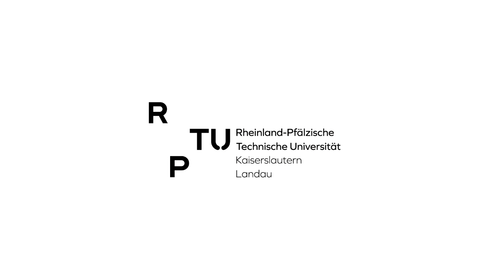

<a name="readme-top"></a>

<div align="center">
  
  <a href="https://github.com/ajavanma/RPTU_AI_Toolkit/releases/tag/v0.0.1" style="display: inline-block;">
    
  </a>
  
  <a href="https://github.com/ajavanma/RPTU_AI_Toolkit/actions" style="display: inline-block;">
    
  </a>
  
  <a href="https://github.com/ajavanma/RPTU_AI_Toolkit/blob/dev/LICENSE" style="display: inline-block;">
    
  </a>
  
</div>


<!-- PROJECT LOGO -->
<br />
<div align="center">
  <a href="https://github.com/ajavanma/RPTU_AI_Toolkit/blob/main">
    
  </a>

  <h3 align="center">RPTU-AI-Toolkit</h3>

  <p align="center">
    A toolkit for preprocessing, training and inference
    <br />
    <a href="https://arash.gitbook.io/rptu-ai-toolkit/"><strong>Explore the docs »</strong></a>
    <br />
    <br />
    <a href="https://github.com/ajavanma/RPTU_AI_Toolkit/issues/new">Report Bug or Request Feature</a>
  </p>
</div>


<!-- TABLE OF CONTENTS -->
<details>
  <summary>Table of Contents</summary>
  <ol>
    <li>
      <a href="#about-the-project">About The Project</a>
      <ul>
        <li><a href="#built-with">Built With</a></li>
      </ul>
    </li>
    <li>
      <a href="#getting-started">Getting Started</a>
      <ul>
        <li><a href="#prerequisites">Prerequisites</a></li>
        <li><a href="#installation">Installation</a></li>
      </ul>
    </li>
    <li><a href="#usage">Usage</a></li>
    <li><a href="#roadmap">Roadmap</a></li>
    <li><a href="#contributing">Contributing</a></li>
    <li><a href="#license">License</a></li>
    <li><a href="#contact">Contact</a></li>
    <li><a href="#acknowledgments">Acknowledgments</a></li>
  </ol>
</details>


## About The Project

This is a toolkit to train a ML model for semantic segmentation of point clouds.  

It covers preprocessing, training and inference, and in this repository it is used to make BIM models based on [IfcOpenShell](https://ifcopenshell.org/) standard from lidar scans.  

  <a href="https://github.com/ajavanma/RPTU_AI_Toolkit/blob/main">
    
  </a>
    <a href="https://github.com/ajavanma/RPTU_AI_Toolkit/blob/main">
    
  </a>


### Built With


* [![PyTorch][PyTorch]][PyTorch-url]
* [![MinkowskiEngine][MinkowskiEngine]][MinkowskiEngine-url]


  <a href="https://github.com/ajavanma/RPTU_AI_Toolkit/blob/main">
    
  </a>


## Installation

1. You can install the Minkowski Engine with `pip`, with anaconda, or on the system directly.  
- [PIP](https://github.com/NVIDIA/MinkowskiEngine#pip) installation
- [Conda](https://github.com/NVIDIA/MinkowskiEngine#anaconda) installation
- [Python](https://github.com/NVIDIA/MinkowskiEngine#system-python) installation
- [Docker](https://github.com/NVIDIA/MinkowskiEngine#docker) installation


2. Install Poetry:
   ```sh
   curl -sSL https://install.python-poetry.org | python3 -

3. Install project dependencies:
poetry install  

4. Set config parameters in config/config.yaml  

5. poetry run python src/main.py  


## Features

- Unlimited high-dimensional sparse tensor support
- All standard neural network layers (Convolution, Pooling, Broadcast, etc.)
- Dynamic computation graph
- Custom kernel shapes
- Multi-GPU training
- Multi-threaded kernel map
- Multi-threaded compilation
- Highly-optimized GPU kernels


## Requirements

- Ubuntu >= 14.04
- CUDA >= 10.1.243 and **the same CUDA version used for pytorch** (e.g. if you use conda cudatoolkit=11.1, use CUDA=11.1 for MinkowskiEngine compilation)
- pytorch >= 1.7 To specify CUDA version, please use conda for installation. You must match the CUDA version pytorch uses and CUDA version used for Minkowski Engine installation. `conda install -y -c nvidia -c pytorch pytorch=1.8.1 cudatoolkit=10.2`)
- python >= 3.6
- ninja (for installation)
- GCC >= 7.4.0


## Program structure
Data Preparation
1. Raw Data Analysis:  
Generate report of each asc and pcd file, check for skewed distribution.

2. Preprocessing:  
Data Preparation: Feature selection, data cleansing, transforming, outlier removal, scaling (normalization/standardization).
Feature Engineering: Imputation (managing missing data), one-hot encoding of categorical features.

3. Training:  
A classification model will be trained based on a CNN architecture

4. Inference:  
Using Blender's python wrapper a BIM-Model will be generated from the trained ML-Model

5. Reports:  
Training and Evaluation  
Iteration (hyperparameter tuning)  
Test and Verification  
Visualizing  


### File hierarchy
data/     &nbsp;   &nbsp;   &nbsp;   &nbsp;   &nbsp;  &nbsp;   &nbsp;  &nbsp;   &nbsp;   # Raw and processed data (pcd, asc, ply), mapping dictionaries (yaml)  
logs/   
models/   &nbsp;   &nbsp;   &nbsp;   &nbsp;  &nbsp;   &nbsp;       # Trained models  
notebooks/  &nbsp;   &nbsp;   &nbsp;     # Jupyter notebooks for exploration and visualization (sanity check of raw and processed data)  
src/      
| ── __init__.py  
| ── config/  
│     &nbsp;   &nbsp;   &nbsp;   &nbsp;   &nbsp;  |── config.yaml  
│     &nbsp;   &nbsp;   &nbsp;   &nbsp;   &nbsp;  |── preprocessing.yaml  
│     &nbsp;   &nbsp;   &nbsp;   &nbsp;   &nbsp;  |── training.yaml  
│     &nbsp;   &nbsp;   &nbsp;   &nbsp;   &nbsp;  └── inference.yaml  
| ── data/  
│     &nbsp;   &nbsp;   &nbsp;   &nbsp;   &nbsp;  └── preprocessing.py  
| ── models/  
│     &nbsp;   &nbsp;   &nbsp;   &nbsp;   &nbsp;  └── model.bin  
| ── training/  
│     &nbsp;   &nbsp;   &nbsp;   &nbsp;   &nbsp;  |── train.py  
│     &nbsp;   &nbsp;   &nbsp;   &nbsp;   &nbsp;  └── evaluate.py  
| ── inference/  
│     &nbsp;   &nbsp;   &nbsp;   &nbsp;   &nbsp;  └── infer.py  
| ── utils/  
│     &nbsp;   &nbsp;   &nbsp;   &nbsp;   &nbsp;  └── utils.py  
└ ── main.py  
tests/  


<!-- USAGE EXAMPLES -->
## Usage


_Please refer to the [Documentation](https://arash.gitbook.io/rptu-ai-toolkit/)_


<!-- ROADMAP -->
## Roadmap

- [x] Add logs
- [ ] Add Demo
- [ ] Add Notebooks
- [ ] Multi-preprocessing Support
    - [x] cpu
    - [x] gpu


<!-- ACKNOWLEDGMENTS -->
## Useful links and other projects using Minkowski Engine

* [Point clouds][Point-clouds]
* [Open3d][open3d-url]
* [Minkowski Engine][MinkowskiEngine-url]
- Segmentation: [3D and 4D Spatio-Temporal Semantic Segmentation, CVPR'19](https://github.com/chrischoy/SpatioTemporalSegmentation)
- Representation Learning: [Fully Convolutional Geometric Features, ICCV'19](https://github.com/chrischoy/FCGF)
- 3D Registration: [Learning multiview 3D point cloud registration, CVPR'20](https://arxiv.org/abs/2001.05119)
- 3D Registration: [Deep Global Registration, CVPR'20](https://arxiv.org/abs/2004.11540)
- Pattern Recognition: [High-Dimensional Convolutional Networks for Geometric Pattern Recognition, CVPR'20](https://arxiv.org/abs/2005.08144)
- Detection: [Generative Sparse Detection Networks for 3D Single-shot Object Detection, ECCV'20](https://arxiv.org/abs/2006.12356)
- Image matching: [Sparse Neighbourhood Consensus Networks, ECCV'20](https://www.di.ens.fr/willow/research/sparse-ncnet/)


<!-- CONTACT -->
## Contact


[](https://www.linkedin.com/in/arash-javanmardi-9567b9167/)


<!-- LICENSE -->
## License

Distributed under the MIT License. See `LICENSE` for more information.

<p align="right">(<a href="#readme-top">back to top</a>)</p>

<!-- MARKDOWN LINKS & IMAGES -->
[issues-shield]: https://img.shields.io/github/issues/othneildrew/Best-README-Template.svg?style=for-the-badge
[issues-url]: https://github.com/ajavanma/RPTU_AI_Toolkit/issues
[license-shield]: https://img.shields.io/github/license/othneildrew/Best-README-Template.svg?style=for-the-badge
[license-url]: https://github.com/ajavanma/RPTU_AI_Toolkit/blob/main/LICENSE.txt
[linkedin-shield]: https://img.shields.io/badge/-LinkedIn-black.svg?style=for-the-badge&logo=linkedin&colorB=555
[linkedin-url]: https://www.linkedin.com/in/arash-javanmardi-9567b9167/
[product-screenshot]: images/screenshot.png
[PyTorch]: https://img.shields.io/badge/PyTorch-%23EE4C2C.svg?style=for-the-badge&logo=PyTorch&logoColor=white
[PyTorch-url]: https://pytorch.org/
[MinkowskiEngine]: https://img.shields.io/badge/nVIDIA-%2376B900.svg?style=for-the-badge&logo=nVIDIA&logoColor=white
[MinkowskiEngine-url]: https://github.com/NVIDIA/MinkowskiEngine
[open3d-url]: https://www.open3d.org/
[Point-clouds]: https://en.wikipedia.org/wiki/Point_cloud


